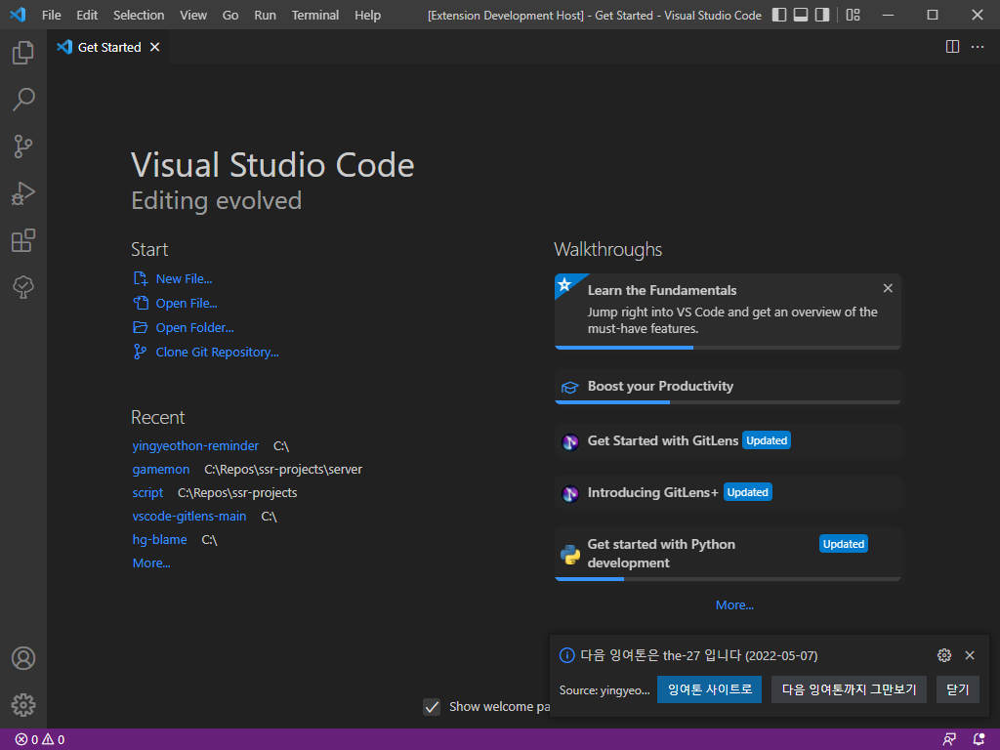
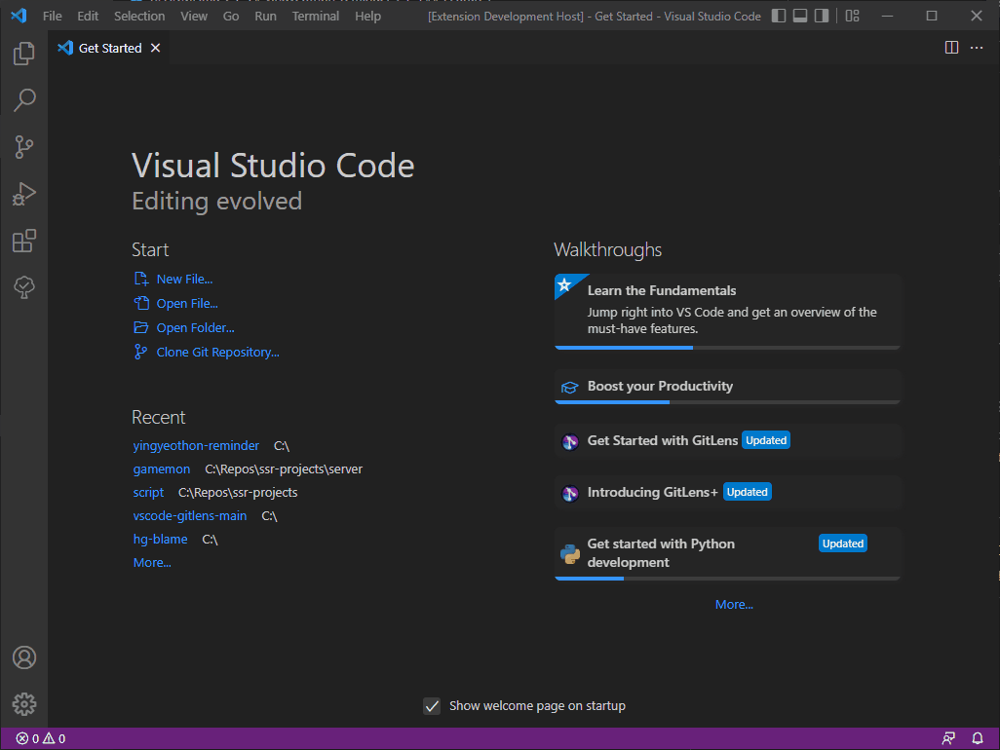

# yingyeothon-reminder

잉여톤27회 참가작, 잉여톤 알리미 확장입니다. 이 확장은 vscode가 켜질때 다음 잉여톤 또는 지난 잉여톤을 알려줍니다.

## Features


Vscode가 startup 될때 우측 하단에 다음 잉여톤 일정을 알려줍니다.
* _잉여톤 사이트로_ 를 클릭해 해당 회차 잉여톤 사이트(yyt.life)로 이동할 수 있습니다.
* _다음 잉여톤까지 그만보기_ 를 클릭해 다음 잉여톤 공지가 생길때 까지 이 알림을 무시할 수 있습니다.


커맨드 팔레트 (Ctrl + Shift + P) 를 사용해 ```YYT: Check Next YingYeoThon``` 입력하면 잉여톤 일정 노티를 띄울 수 있습니다.


## Requirements

VSCode: ^1.60 (그렇다고 해서 최신 기능들을 다 사용하진 않음)

## Extension Settings

없음.

## Known Issues

코드가 개판임.

## Release Notes

### 1.0.0
첫 릴리즈 빌드. 아래와 같은 기능들이 구현됨.
* startup때 잉여톤 노티
* 커맨드로 잉여톤 노티
* 다음 잉여톤까지 노티하지 않기
* 해당 회차 잉여톤 웹사이트로 이동
